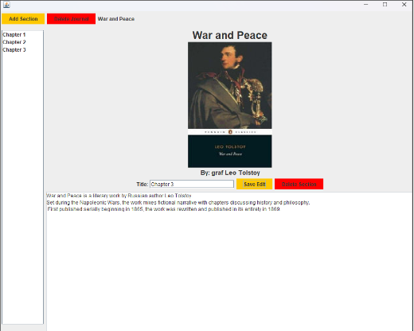

# Reading-Journal-App

As an avid reader and a university student, I find it frustrating that there aren't any journaling apps that cater to reading. The available journaling apps now are typically those that are used for journaling thoughts and reflections. To learn about building full-stack apps in Java, I decided to make my idea come to life. 

Although this is a personal project, I did make a presentation summarising the design and implementation journey of the app, reference design.pdf.

## Explanation of the app

From the problem statement, the proposed solution is a journaling app that allows users to write down their thoughts and summaries about specific reading material. This can be a book or a PDF material (for example, it might be a PDF of their university lecture material).

## Requirements 

Once the proposed solution had been established, I began drafting a requirements definition for the app. This ensured that I had a set of goals to work towards. 

## Design 

### App Flow

I began designing the app itself, from the flow of the pages to their front-end design. I found that producing high-quality designs made the implementation stage much easier as everything had already been laid out. 

### Entity Relationships

To establish the relations between all the entities and records, I produced some UML and ER diagrams. 

## Final Result 

The main page:

Sub-directory of a folder: 

Uploading a journal using ISBN: 

Uploading a journal using PDF:

Viewing uploaded PDF: 

Viewing uploaded book: 

## Testing

Finally, testing is done to ensure that the app is fully functional according to the design document.

